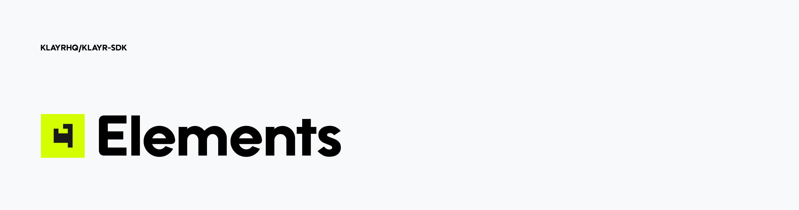

# Klayr Elements

[](http://www.apache.org/licenses/LICENSE-2.0)

## What is Klayr Elements

Klayr Elements is a collection of libraries, each of them implementing some form of blockchain application functionality such as cryptography, transactions, p2p, etc. Each library is designed to be compatible with the [Klayr Protocol](https://klayr.xyz/documentation/klayr-sdk/protocol).

Klayr Elements supports the modular architecture of the Klayr SDK, where libraries can be created or modified to suit individual blockchain application requirements.

## Packages

| Package                                       |                           Version                            | Description                                                                                               |
| --------------------------------------------- | :----------------------------------------------------------: | --------------------------------------------------------------------------------------------------------- |
| [@klayr/elements](./elements)                 |          | Package contains everything                                                                               |
| [@klayr/api-client](./api-client)             |        | An API client for the Klayr network                                                                       |
| [@klayr/chain](./chain)                       |             | Implements blocks and state management that are used for block processing according to the Klayr protocol |
| [@klayr/codec](./codec)                       |             | Decoder and encoder using Klayr JSON schema according to the Klayr protocol                               |
| [@klayr/cryptography](./cryptography)         |      | General cryptographic functions for use with Klayr-related software                                       |
| [@liskhq/lisk-db](./lisk-db)                  |          | A database access implementation for use with Klayr-related software                                      |
| [@klayr/p2p](./p2p)                           |               | _unstructured_ P2P library for the Klayr protocol                                                         |
| [@klayr/passphrase](./passphrase)             |        | Mnemonic passphrase helpers for use with Klayr-related software                                           |
| [@klayr/transactions](./transactions)         |      | Everything related to transactions according to the Klayr protocol                                        |
| [@klayr/transaction-pool](./transaction-pool) |  | Transaction pool implementation for the Klayr network                                                     |
| [@klayr/tree](./tree)                         |              | Merkle tree implementations for use with Klayr-related software                                           |
| [@klayr/utils](./utils)                       |             | Generic utility functions for use with Klayr-related software                                             |
| [@klayr/validator](./validator)               |         | Validation library according to the Klayr protocol                                                        |

## Installation

If you want to install all elements as dependency of your project you can install it via.

```sh
$ npm install --save @klayr/elements
```

Or you can install individual packages what you need e.g.

```sh
$ npm install --save @klayr/transactions
$ npm install --save @klayr/cryptography
```

## Get Involved

| Reason                          | How                                                                                             |
| ------------------------------- | ----------------------------------------------------------------------------------------------- |
| Want to chat with our community | [Reach them on Discord](http://klayr.chat)                                                      |
| Found a bug                     | [Open a new issue](https://github.com/KlayrHQ/klayr-sdk/issues/new)                             |
| Found a security issue          | [See our bounty program](https://blog.lisk.com/announcing-lisk-bug-bounty-program-5895bdd46ed4) |
| Want to share your research     | [Propose your research](https://research.lisk.com)                                              |
| Want to develop with us         | [Create a fork](https://github.com/KlayrHQ/klayr-sdk/fork)                                      |

## License

Copyright 2016-2020 Lisk Foundation

Licensed under the Apache License, Version 2.0 (the "License");
you may not use this file except in compliance with the License.
You may obtain a copy of the License at

http://www.apache.org/licenses/LICENSE-2.0

Unless required by applicable law or agreed to in writing, software
distributed under the License is distributed on an "AS IS" BASIS,
WITHOUT WARRANTIES OR CONDITIONS OF ANY KIND, either express or implied.
See the License for the specific language governing permissions and
limitations under the License.
